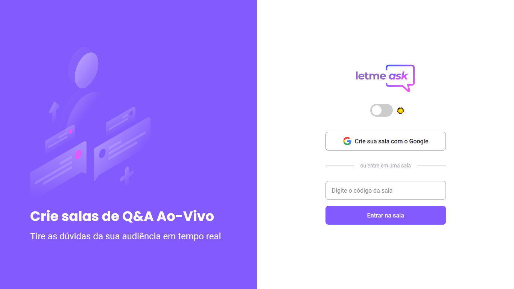

<h1 align="center">
  
</h1>


<p align="center">
  
  
  
  
</p>

<p align="center">
  <a href="#dart-about">About</a> &#xa0; | &#xa0; 
  <a href="#sparkles-features">Features</a> &#xa0; | &#xa0;
  <a href="#rocket-technologies">Technologies</a> &#xa0; | &#xa0;
  <a href="#white_check_mark-requirements">Requirements</a> &#xa0; | &#xa0;
  <a href="#checkered_flag-starting">Starting</a> &#xa0; | &#xa0;
  <a href="#memo-license">License</a> &#xa0; | &#xa0;
  <a href="https://github.com/LDrawe" target="_blank">Author</a>
</p>

<h1 align="center">
  
</h1>

<br>

## :newspaper: About ##

Letmeask is an application developed during <abbr title="Next Level Week">NLW</abbr>#06 that allows users to create rooms to receive and answer questions.

## :star2: Features ##

:heavy_check_mark: Login with Google\
:heavy_check_mark: Create Room\
:heavy_check_mark: Join Room\
:heavy_check_mark: Create a question\
:heavy_check_mark: Answer a question\
:heavy_check_mark: HighLight a question\
:heavy_check_mark: Like a question

## :test_tube: Technologies ##


The following tools were used in this project:

- [React](https://pt-br.reactjs.org/)
- [Firebase](https://firebase.google.com/)
- [Sass](https://sass-lang.com/)
- [TypeScript](https://www.typescriptlang.org/)

## :white_check_mark: Requirements ##

Before starting, you need to have [Git](https://git-scm.com) and [Node](https://nodejs.org/en/) installed.

## :rocket: Starting ##

```bash
# Clone this project
$ git clone https://github.com/LDrawe/letmeask

# Access
$ cd letmeask

# Install dependencies
$ yarn

# Run the project
$ yarn start

```
The app will initialize in http://localhost:3000

## :memo: License ##

This project is under license from MIT. For more details, see the [LICENSE](LICENSE.md) file.


&#xa0;

<a href="#top">Back to top</a>
